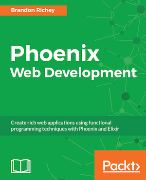

[](https://gitpitch.com/enogrob/ebook-project/master)
```
Roberto Nogueira  
BSd EE, MSd CE
Solution Integrator Experienced - Certified by Ericsson
```
# eBook Phoenix Web Development



**About**

Learn everything you need to about the subject of this `eBook` project.

[Homepage](https://www.packtpub.com/web-development/phoenix-web-development)

## Topics
```
1: A BRIEF INTRODUCTION TO ELIXIR AND PHOENIX
[ ] Introducing IEx and Elixir
[ ] Introduction to Phoenix
[ ] Creating a new Phoenix project
[ ] Summary
2: BUILDING CONTROLLERS, VIEWS, AND TEMPLATES
[ ] Understanding the flow of Phoenix connections
[ ] Creating our Social Voting project
[ ] Creating a poll controller
[ ] Writing controller tests
[ ] Summary
3: STORING AND RETRIEVING VOTE DATA WITH ECTO PAGES
[ ] Understanding the role of schemas
[ ] Creating a new migration
[ ] Creating our Poll schema
[ ] Creating our Option schema
[ ] Understanding the role of contexts
[ ] Creating a new poll
[ ] Writing our unit tests
[ ] Summary
4: INTRODUCING USER ACCOUNTS AND SESSIONS
[ ] Adding user accounts
[ ] Summary
5: VALIDATIONS, ERRORS, AND TYING LOOSE ENDS
[ ] Connecting polls to users
[ ] Summary
6: LIVE VOTING WITH PHOENIX
[ ] Building channels and topics in Phoenix
[ ] Summary
7: IMPROVING OUR APPLICATION AND ADDING FEATURES
[ ] Designing and implementing our new features
[ ] Summary
8: ADDING CHAT TO YOUR PHOENIX APPLICATION
[ ] Adding chat to a Phoenix application
[ ] Summary
9: USING PRESENCE AND ETS IN PHOENIX
[ ] Utilizing Presence and ETS to make our app more robust
Summary
10: WORKING WITH ELIXIR'S CONCURRENCY MODEL
Introduction to Elixir's concurrency model
[ ] Summary
11: IMPLEMENTING OAUTH IN OUR APPLICATION
[ ] Solidifying the new user experience
[ ] Adding Ueberauth support
[ ] Summary
12: BUILDING AN API AND DEPLOYING
[ ] Building our API
[ ] Deploying Phoenix applications to production
[ ] Summary
```
